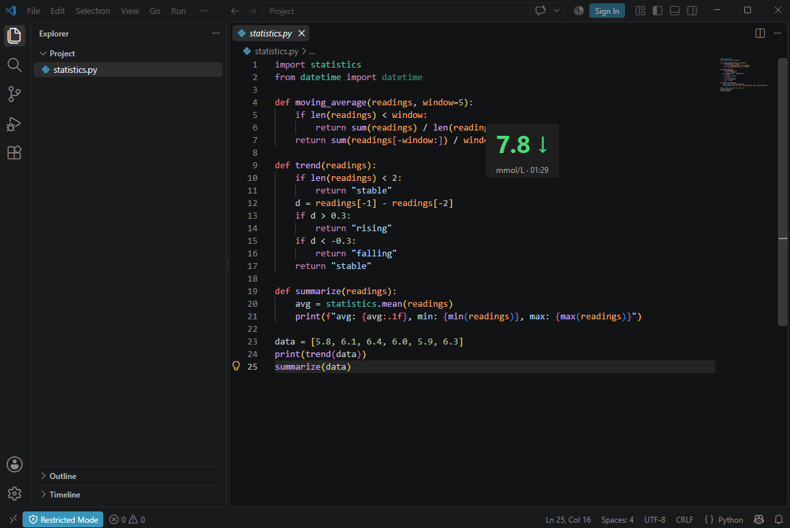

# ⚡ Glance Glucose

**Checking your blood sugar shouldn't require unlocking your phone and opening an app.**

A lightweight tool that pulls live glucose data from a FreeStyle Libre 3+ sensor (read via the Libre 3 app and Abbott's LibreLinkUp cloud) and displays it instantly in a small always-on-top desktop widget

Built for myself as a Type 1 diabetic tired of checking my phone up to 70 times a day to see my glucose readings.


*Sample reading shown for demonstration. NOT a real glucose value.*

## How it works

Sensor (Bluetooth) → Libre 3 App → Abbott Cloud → LibreLinkUp API → This Script → Desktop Widget

The Libre 3 app uploads each new reading to Abbott's cloud every minute. This script logs into that cloud through the same API the official LibreLinkUp companion app uses, fetches the latest reading every 60 seconds, and displays it in a colour-coded widget — green in range, red low, orange high.

## Features

- Live glucose value, trend arrow, and timestamp
- Colour-coded to your personal target range
- Small, draggable, always-on-top widget
- Credentials kept out of the code via `.env`

## Setup

1. In the Libre 3 app: **Menu → Connected Apps → LibreLinkUp** → invite a second email address you own.
2. Install the LibreLinkUp app, log in with that second email, accept the invite. (Can uninstall after.)
3. Clone this repo and install dependencies:
```bash
   pip install -r requirements.txt
```
4. Create a `.env` file in the project folder:
LLU_EMAIL=your-linkup-email@example.com
LLU_PASSWORD=your-password

5. Run it:
```bash
   python "Glukose app.py"
```

## ⚠️ Disclaimer

Not affiliated with or endorsed by Abbott. This is a personal, display-only project built on an unofficial API. **Not a substitute for the official Libre app and never intended for treatment decisions.**

## Why this matters to me.

Started as a fix for my own annoyance, but honestly, this should just be a built-in feature. Abbott adding lock-screen and watch support would save a lot of people the trouble of building their own workaround.
